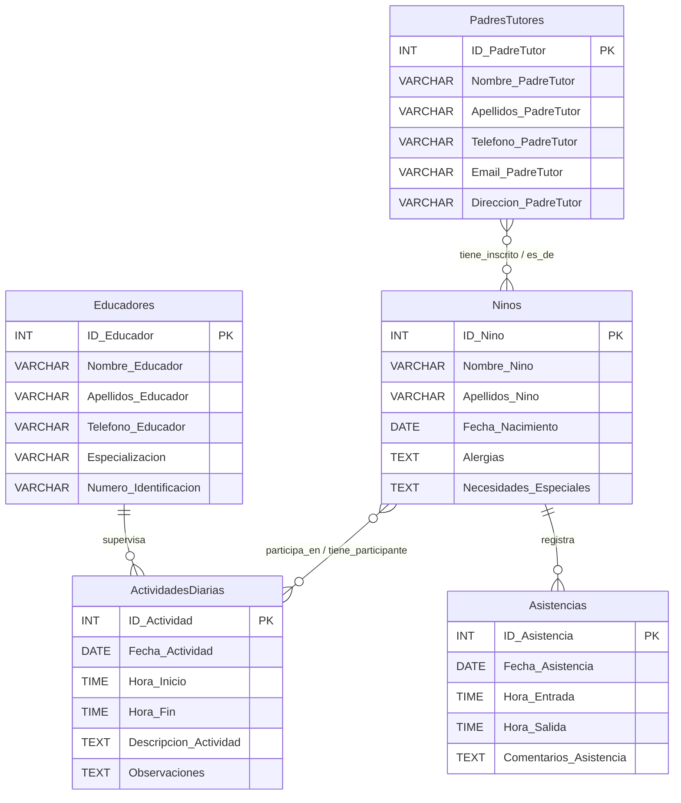

```mermaid
erDiagram
    PadresTutores }o--o{ Ninos : "tiene_inscrito / es_de"
    Ninos }o--o{ ActividadesDiarias : "participa_en / tiene_participante"
    Ninos ||--o{ Asistencias : "registra"
    Educadores ||--o{ ActividadesDiarias : "supervisa"

    PadresTutores {
        INT ID_PadreTutor PK
        VARCHAR Nombre_PadreTutor
        VARCHAR Apellidos_PadreTutor
        VARCHAR Telefono_PadreTutor
        VARCHAR Email_PadreTutor
        VARCHAR Direccion_PadreTutor
    }

    Ninos {
        INT ID_Nino PK
        VARCHAR Nombre_Nino
        VARCHAR Apellidos_Nino
        DATE Fecha_Nacimiento
        TEXT Alergias
        TEXT Necesidades_Especiales
    }

    Educadores {
        INT ID_Educador PK
        VARCHAR Nombre_Educador
        VARCHAR Apellidos_Educador
        VARCHAR Telefono_Educador
        VARCHAR Especializacion
        VARCHAR Numero_Identificacion
    }

    ActividadesDiarias {
        INT ID_Actividad PK
        DATE Fecha_Actividad
        TIME Hora_Inicio
        TIME Hora_Fin
        TEXT Descripcion_Actividad
        TEXT Observaciones
    }

    Asistencias {
        INT ID_Asistencia PK
        DATE Fecha_Asistencia
        TIME Hora_Entrada
        TIME Hora_Salida
        TEXT Comentarios_Asistencia
    }
```
